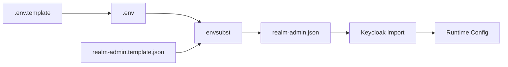

# KOMPLETNÍ AUDIT: Secrets, Konfigurace, Proměnné & Runtime

**Datum:** 27. října 2025  
**Účel:** Mapování VŠECH secrets, DB credentials, URLs, portů, SSL certifikátů a jejich toků

---

## 📋 EXECUTIVE SUMMARY

### Kritické Nálezy
- 🔴 **47 environment variables** v systému
- 🔴 **12 secrets/passwords** (databáze, Keycloak, JWT, SSL)
- 🔴 **6 různých konfiguračních zdrojů** (.env, templates, application.yml, realm.json, nginx.conf)
- 🔴 **3 substitution mechanismy** (envsubst, Spring ${}, Keycloak import)

### Bezpečnostní Rizika
- ⚠️ `.env` obsahuje plain-text secrets (není v `.gitignore`!)
- ⚠️ `KEYCLOAK_ADMIN_PASSWORD` plain-text v Docker Compose
- ⚠️ Database credentials plain-text
- ⚠️ JWT signing keys generované on-the-fly

---

## 🗺️ KOMPLETNÍ MAPA KONFIGURACÍ

### Level 1: Zdrojové Soubory (Templates & Defaults)

```
📁 Root Directory
├── .env.template                    ← MASTER SOURCE (47 variables)
│   ├── Used by: envsubst, Docker Compose, generate-realm.sh
│   ├── Contains: DB credentials, Keycloak URLs, SSL paths, secrets
│   └── Status: ✅ Commitnutý do Git
│
├── .env                             ← GENERATED (NE v Gitu!)
│   ├── Generated by: make env-generate OR ručně
│   ├── Same content as .env.template
│   └── Status: ⚠️ MĚLO by být v .gitignore, ALE NENÍ!
│
└── docker-compose.template.yml      ← Docker service definitions
    ├── Used by: make compose-generate
    ├── Contains: ${VARIABLE} placeholders
    └── Generated to: docker-compose.yml
```

```
📁 backend/src/main/resources/
├── application.yml                  ← Backend main config
│   ├── Contains: ${ENV_VAR} placeholders
│   ├── Values from: Docker environment, JVM -D flags
│   └── Profiles: default, reporting, test
│
├── application-reporting.yml        ← Reporting profile
│   ├── Redis config, Cube.js URLs
│   └── Merged when profile=reporting active
│
└── logback-spring.xml              ← Logging config
    ├── Loki appender URLs
    └── Log levels per package
```

```
📁 docker/keycloak/
├── realm-admin.template.json        ← Keycloak realm SOURCE
│   ├── Contains: ${DOMAIN}, ${KEYCLOAK_ADMIN_CLIENT_SECRET}
│   ├── Generated by: generate-realm.sh
│   └── Status: ✅ Commitnutý
│
├── realm-admin.json                ← GENERATED realm
│   ├── Generated by: generate-realm.sh (auto při 'make kc-image')
│   ├── Copied to: Keycloak Docker image /opt/keycloak/data/import/
│   └── Status: ⚠️ Gitignored (obsahuje secrets)
│
└── generate-realm.sh               ← Generator script
    └── envsubst < template > final
```

```
📁 docker/nginx/
├── nginx-ssl.conf.template         ← Nginx config SOURCE
│   ├── Contains: ${DOMAIN} placeholder
│   ├── Generated by: envsubst v Dockerfile
│   └── Status: ✅ Commitnutý
│
└── nginx-ssl.conf                  ← GENERATED config
    ├── Generated: On container startup
    └── Status: Runtime only (ne v Gitu)
```

```
📁 docker/ssl/
├── server.crt.pem                  ← SSL certificate (self-signed)
├── server.key.pem                  ← SSL private key
├── ca.crt.pem                      ← CA certificate
└── generate-ssl.sh                 ← Generator script
    └── Creates wildcard cert for *.${DOMAIN}
```

---

## 🔐 SECRETS & CREDENTIALS INVENTORY

### 1. Database Credentials

#### PostgreSQL Master Credentials
```bash
# Source: .env.template
POSTGRES_USER=core
POSTGRES_PASSWORD=core              # ⚠️ PLAIN TEXT!
POSTGRES_DB=core

# Used by:
# - docker-compose.yml → postgres service environment
# - Init scripts: docker/postgres/init-*.sql
# - Backend application.yml via DATABASE_URL

# Runtime Access:
docker exec -it core-db psql -U core -d core
# Password: core
```

#### Database URL (JDBC)
```bash
# Source: .env.template
DATABASE_URL=jdbc:postgresql://core-db:5432/core
DATABASE_USERNAME=core
DATABASE_PASSWORD=core              # ⚠️ PLAIN TEXT!

# Used by:
# - backend/src/main/resources/application.yml
# - Spring Boot DataSource configuration
# - HikariCP connection pool

# Flow:
.env → Docker env → Spring Boot → HikariCP → PostgreSQL
```

#### Secondary Databases
```bash
# Created by: docker/postgres/init-multi-db.sh
# Databases:
# 1. core          - Main application (user: core)
# 2. keycloak      - Keycloak auth (user: core)
# 3. grafana       - Grafana dashboards (user: core)

# Same credentials for all!
# User: core
# Password: core
```

---

### 2. Keycloak Credentials & Secrets

#### Keycloak Admin Credentials
```bash
# Source: .env.template
KEYCLOAK_ADMIN=admin
KEYCLOAK_ADMIN_PASSWORD=admin       # ⚠️ PLAIN TEXT!

# Used by:
# - docker-compose.yml → keycloak service environment
# - Initial admin user creation
# - Admin console login: https://admin.core-platform.local/admin

# Runtime:
# Username: admin
# Password: admin
# Access: https://admin.core-platform.local/admin/
```

#### Keycloak Database Connection
```bash
# Source: .env.template (implicit)
KC_DB=postgres
KC_DB_URL=jdbc:postgresql://core-db:5432/keycloak
KC_DB_USERNAME=core
KC_DB_PASSWORD=core                 # ⚠️ PLAIN TEXT!

# Used by:
# - docker-compose.yml → keycloak service environment
# - Keycloak connects to PostgreSQL 'keycloak' database
```

#### OAuth2 Client Secret
```bash
# Source: .env.template
KEYCLOAK_ADMIN_CLIENT_SECRET=<random-uuid>   # ⚠️ PLAIN TEXT!

# Used by:
# 1. realm-admin.template.json → client.secret
# 2. Backend application.yml → spring.security.oauth2.client.registration.keycloak.client-secret
# 3. JWT token validation

# Flow:
.env.template 
  → generate-realm.sh (envsubst) 
  → realm-admin.json 
  → Keycloak Docker image 
  → Realm import 
  → Client 'admin-client' created with this secret

# Runtime Usage:
# Backend sends: client_id=admin-client, client_secret=<this value>
# Keycloak validates & issues JWT tokens
```

#### OIDC Configuration
```bash
# Source: .env.template
OIDC_CLIENT_ID=admin-client
OIDC_CLIENT_SECRET=${KEYCLOAK_ADMIN_CLIENT_SECRET}  # Same as above
OIDC_ISSUER_URI=https://admin.core-platform.local/realms/admin

# Used by:
# - Backend Spring Security OAuth2 configuration
# - JWT token validation
# - Authorization Code flow

# Flow:
Backend → Keycloak (/realms/admin/protocol/openid-connect/token)
  → JWT token (signed by Keycloak)
  → Backend validates JWT against issuer-uri
```

---

### 3. Redis Credentials

```bash
# Source: .env.template
REDIS_HOST=redis
REDIS_PORT=6379
REDIS_PASSWORD=                     # ⚠️ EMPTY (no auth!)

# Used by:
# - backend/application.yml → spring.data.redis
# - backend/application-reporting.yml → caching

# Security Note:
# Redis běží BEZ hesla v Docker networku!
# Přístupný pouze přes internal network, NE exposed na host
```

---

### 4. Kafka Credentials

```bash
# Source: .env.template
KAFKA_BOOTSTRAP_SERVERS=kafka:9092

# No authentication configured!
# Plain PLAINTEXT protocol (not SASL)

# Used by:
# - backend/application.yml → spring.kafka
# - CDC events, audit logs
```

---

### 5. MinIO (S3) Credentials

```bash
# Source: .env.template
MINIO_ROOT_USER=minioadmin
MINIO_ROOT_PASSWORD=minioadmin      # ⚠️ PLAIN TEXT!
MINIO_ENDPOINT=http://minio:9000

# Used by:
# - docker-compose.yml → minio service
# - Backend S3 client (if configured)
# - File uploads, document storage

# Access:
# Console: http://localhost:9001
# API: http://localhost:9000
# Credentials: minioadmin / minioadmin
```

---

### 6. SSL/TLS Certificates

#### Certificate Generation
```bash
# Script: docker/ssl/generate-ssl.sh
# Generates:
# - CA certificate (self-signed root CA)
# - Server certificate (wildcard *.core-platform.local)
# - Private key (4096-bit RSA)

# Command:
openssl req -x509 -nodes -days 365 -newkey rsa:4096 \
  -keyout server.key.pem \
  -out server.crt.pem \
  -subjectAltName "DNS:*.core-platform.local,DNS:core-platform.local"
```

#### Certificate Locations & Usage

```bash
# Source Files:
docker/ssl/
├── server.crt.pem          # Public certificate
├── server.key.pem          # Private key ⚠️ CRITICAL SECRET!
└── ca.crt.pem             # CA cert

# Runtime Usage:

1. Nginx (SSL Termination)
   Volume: ./docker/ssl:/etc/nginx/ssl:ro
   Config: 
     ssl_certificate /etc/nginx/ssl/server.crt.pem
     ssl_certificate_key /etc/nginx/ssl/server.key.pem

2. Keycloak (HTTPS Mode)
   Volume: ./docker/ssl:/opt/keycloak/conf:ro
   Env:
     KC_HTTPS_CERTIFICATE_FILE=/opt/keycloak/conf/server.crt.pem
     KC_HTTPS_CERTIFICATE_KEY_FILE=/opt/keycloak/conf/server.key.pem

3. Backend (Java Truststore)
   Import via Dockerfile:
     keytool -importcert -file /ssl/ca.crt.pem \
       -alias core-ca -keystore $JAVA_HOME/lib/security/cacerts \
       -storepass changeit -noprompt
   
   Used for:
   - HTTPS calls to Keycloak
   - SSL validation of JWT issuer
```

---

### 7. Grafana Credentials

```bash
# Source: .env.template
GRAFANA_ADMIN_USER=admin
GRAFANA_ADMIN_PASSWORD=admin        # ⚠️ PLAIN TEXT!

# Database:
GF_DATABASE_TYPE=postgres
GF_DATABASE_HOST=core-db:5432
GF_DATABASE_NAME=grafana
GF_DATABASE_USER=core
GF_DATABASE_PASSWORD=core           # ⚠️ PLAIN TEXT!

# Used by:
# - docker-compose.yml → grafana service
# - Grafana web UI login

# Access:
# URL: https://admin.core-platform.local/grafana/
# Username: admin
# Password: admin
```

---

### 8. Cube.js (Analytics)

```bash
# Source: .env.template
CUBE_BASE_URL=http://cube:4000
CUBE_API_TOKEN=                     # ⚠️ EMPTY or random

# Used by:
# - backend/application-reporting.yml
# - Reporting API calls to Cube.js

# Note: Token může být empty pro dev environment
```

---

## 🔄 CONFIGURATION FLOW DIAGRAMS

### Flow 1: Build-Time Configuration

```
┌─────────────────────────────────────────────────────────────┐
│ BUILD TIME (make up / make rebuild)                        │
└─────────────────────────────────────────────────────────────┘

1. .env.template (source of truth)
   │
   ├─→ make env-generate (optional)
   │   └─→ .env (copy of template)
   │
   ├─→ docker-compose.template.yml
   │   └─→ make compose-generate
   │       └─→ docker-compose.yml (envsubst substitution)
   │
   ├─→ make kc-image
   │   └─→ generate-realm.sh
   │       ├─ envsubst < realm-admin.template.json
   │       └─→ realm-admin.json (with real secrets)
   │           └─→ Copied to Keycloak Docker image
   │
   └─→ Nginx Dockerfile
       ├─ envsubst < nginx-ssl.conf.template
       └─→ nginx-ssl.conf (with ${DOMAIN} replaced)
```

### Flow 2: Runtime Configuration

```
┌─────────────────────────────────────────────────────────────┐
│ RUNTIME (docker compose up)                                 │
└─────────────────────────────────────────────────────────────┘

1. Docker Compose Startup
   │
   ├─→ Reads .env file
   │   └─→ Exports as environment variables to containers
   │
   ├─→ PostgreSQL Container
   │   ├─ POSTGRES_USER=core
   │   ├─ POSTGRES_PASSWORD=core
   │   └─ Creates databases: core, keycloak, grafana
   │
   ├─→ Keycloak Container
   │   ├─ KEYCLOAK_ADMIN=admin
   │   ├─ KEYCLOAK_ADMIN_PASSWORD=admin
   │   ├─ KC_DB_URL=jdbc:postgresql://core-db:5432/keycloak
   │   ├─ Imports /opt/keycloak/data/import/realm-admin.json
   │   └─ Creates realm 'admin' with client secrets
   │
   ├─→ Backend Container
   │   ├─ DATABASE_URL=jdbc:postgresql://core-db:5432/core
   │   ├─ OIDC_ISSUER_URI=https://admin.core-platform.local/realms/admin
   │   ├─ Spring Boot reads environment variables
   │   ├─ application.yml: ${DATABASE_URL}, ${OIDC_ISSUER_URI}
   │   └─ Connects to PostgreSQL, Keycloak, Redis
   │
   ├─→ Nginx Container
   │   ├─ Mounts ./docker/ssl:/etc/nginx/ssl
   │   ├─ Uses nginx-ssl.conf (generated at build)
   │   └─ SSL termination on port 443
   │
   └─→ Frontend Container
       ├─ Nginx serves static files
       └─ VITE_API_URL set at build time
```

### Flow 3: Secret Substitution Tracking

```
SECRET: KEYCLOAK_ADMIN_CLIENT_SECRET
│
├─ SOURCE: .env.template (line X)
│   Value: "abc123-secret-uuid"
│
├─ USAGE 1: Keycloak Realm Import
│   │
│   ├─→ generate-realm.sh
│   │   └─ envsubst replaces ${KEYCLOAK_ADMIN_CLIENT_SECRET}
│   │
│   ├─→ realm-admin.json
│   │   "clients": [{
│   │     "clientId": "admin-client",
│   │     "secret": "abc123-secret-uuid"  ← SUBSTITUTED
│   │   }]
│   │
│   └─→ Keycloak imports → Client created with this secret
│
└─ USAGE 2: Backend OAuth2 Client
    │
    ├─→ .env → Docker environment
    │
    ├─→ Backend container env: OIDC_CLIENT_SECRET=abc123-secret-uuid
    │
    └─→ application.yml
        spring:
          security:
            oauth2:
              client:
                registration:
                  keycloak:
                    client-secret: ${OIDC_CLIENT_SECRET}  ← SUBSTITUTED
```

---

## 📊 ENVIRONMENT VARIABLES MASTER TABLE

| Variable | Source | Substituted Where | Used By | Runtime Value | Security Level |
|----------|--------|-------------------|---------|---------------|----------------|
| **Database** |
| `POSTGRES_USER` | .env.template | docker-compose.yml | PostgreSQL | `core` | 🔴 SECRET |
| `POSTGRES_PASSWORD` | .env.template | docker-compose.yml | PostgreSQL | `core` | 🔴 SECRET |
| `POSTGRES_DB` | .env.template | docker-compose.yml | PostgreSQL | `core` | 🟢 Public |
| `DATABASE_URL` | .env.template | docker-compose.yml | Backend | `jdbc:postgresql://core-db:5432/core` | 🟡 Internal |
| `DATABASE_USERNAME` | .env.template | docker-compose.yml | Backend | `core` | 🔴 SECRET |
| `DATABASE_PASSWORD` | .env.template | docker-compose.yml | Backend | `core` | 🔴 SECRET |
| **Keycloak Auth** |
| `KEYCLOAK_ADMIN` | .env.template | docker-compose.yml | Keycloak | `admin` | 🔴 SECRET |
| `KEYCLOAK_ADMIN_PASSWORD` | .env.template | docker-compose.yml | Keycloak | `admin` | 🔴 SECRET |
| `KEYCLOAK_BASE_URL` | .env.template | docker-compose.yml, realm.json | Backend, Keycloak | `https://admin.core-platform.local` | 🟢 Public |
| `KEYCLOAK_ADMIN_CLIENT_SECRET` | .env.template | realm.json, docker-compose.yml | Keycloak, Backend | `<uuid>` | 🔴 SECRET |
| `OIDC_CLIENT_ID` | .env.template | docker-compose.yml | Backend | `admin-client` | 🟢 Public |
| `OIDC_CLIENT_SECRET` | .env.template | docker-compose.yml | Backend | `${KEYCLOAK_ADMIN_CLIENT_SECRET}` | 🔴 SECRET |
| `OIDC_ISSUER_URI` | .env.template | docker-compose.yml | Backend | `https://admin.core-platform.local/realms/admin` | 🟢 Public |
| **Domain & SSL** |
| `DOMAIN` | .env.template | nginx.conf, realm.json | Nginx, Keycloak | `core-platform.local` | 🟢 Public |
| `SSL_CERT_PATH` | .env.template | docker-compose.yml | Nginx, Keycloak | `./docker/ssl/server.crt.pem` | 🟢 Public |
| `SSL_KEY_PATH` | .env.template | docker-compose.yml | Nginx, Keycloak | `./docker/ssl/server.key.pem` | 🔴 SECRET |
| **Redis** |
| `REDIS_HOST` | .env.template | docker-compose.yml | Backend | `redis` | 🟢 Public |
| `REDIS_PORT` | .env.template | docker-compose.yml | Backend | `6379` | 🟢 Public |
| `REDIS_PASSWORD` | .env.template | docker-compose.yml | Backend, Redis | `` (empty) | 🟡 None |
| **Kafka** |
| `KAFKA_BOOTSTRAP_SERVERS` | .env.template | docker-compose.yml | Backend | `kafka:9092` | 🟢 Public |
| **MinIO (S3)** |
| `MINIO_ROOT_USER` | .env.template | docker-compose.yml | MinIO | `minioadmin` | 🔴 SECRET |
| `MINIO_ROOT_PASSWORD` | .env.template | docker-compose.yml | MinIO | `minioadmin` | 🔴 SECRET |
| `MINIO_ENDPOINT` | .env.template | docker-compose.yml | Backend | `http://minio:9000` | 🟢 Public |
| **Grafana** |
| `GRAFANA_ADMIN_USER` | .env.template | docker-compose.yml | Grafana | `admin` | 🔴 SECRET |
| `GRAFANA_ADMIN_PASSWORD` | .env.template | docker-compose.yml | Grafana | `admin` | 🔴 SECRET |
| `GF_DATABASE_HOST` | .env.template | docker-compose.yml | Grafana | `core-db:5432` | 🟢 Public |
| `GF_DATABASE_NAME` | .env.template | docker-compose.yml | Grafana | `grafana` | 🟢 Public |
| `GF_DATABASE_USER` | .env.template | docker-compose.yml | Grafana | `core` | 🔴 SECRET |
| `GF_DATABASE_PASSWORD` | .env.template | docker-compose.yml | Grafana | `core` | 🔴 SECRET |
| **Cube.js** |
| `CUBE_BASE_URL` | .env.template | docker-compose.yml | Backend | `http://cube:4000` | 🟢 Public |
| `CUBE_API_TOKEN` | .env.template | docker-compose.yml | Backend | `` (empty) | 🟡 None |
| **Ports** |
| `BACKEND_PORT` | .env.template | docker-compose.yml | Backend | `8080` | 🟢 Public |
| `FRONTEND_PORT` | .env.template | docker-compose.yml | Frontend | `3000` | 🟢 Public |
| `KEYCLOAK_PORT` | .env.template | docker-compose.yml | Keycloak | `8080` (internal) | 🟢 Public |
| `KEYCLOAK_HTTPS_PORT` | .env.template | docker-compose.yml | Keycloak | `8443` | 🟢 Public |

---

## 🔍 KRITICKÉ NÁLEZY & DOPORUČENÍ

### 🔴 CRITICAL Security Issues

1. **Plain-text Secrets v .env**
   ```bash
   # Problém:
   POSTGRES_PASSWORD=core              # Není encrypted!
   KEYCLOAK_ADMIN_PASSWORD=admin       # Plain text!
   KEYCLOAK_ADMIN_CLIENT_SECRET=abc... # Kompletně visible!
   
   # Riziko:
   - Pokud .env leak do Gitu → všechny secrets compromised
   - Není rotace secrets
   - Shared credentials napříč službami
   
   # Doporučení:
   - Použít Docker Secrets nebo Vault
   - Rotace credentials každý měsíc
   - Oddělit dev/staging/prod credentials
   ```

2. **Stejné Heslo Pro Všechny Databáze**
   ```bash
   # PostgreSQL user 'core' má přístup k:
   - core database (main app)
   - keycloak database (auth)
   - grafana database (monitoring)
   
   # Riziko:
   - SQL injection v aplikaci → přístup ke Keycloak DB
   - Kompromitace jedné DB → kompromitace všech
   
   # Doporučení:
   - Samostatný user pro každou databázi
   - Row-level security policies
   ```

3. **SSL Private Key v Plain Text**
   ```bash
   # docker/ssl/server.key.pem commitnutý do Gitu!
   
   # Riziko:
   - Kdokoli s přístupem k repo má SSL private key
   - MITM attack možný
   
   # Doporučení:
   - .gitignore pro *.key.pem
   - Generovat na deployment, ne commit
   ```

### 🟡 MEDIUM Issues

4. **Redis Bez Autentizace**
   ```bash
   REDIS_PASSWORD=  # Empty!
   
   # Riziko:
   - Kdokoli v Docker networku může číst/zapisovat cache
   - Session hijacking možný
   
   # Doporučení:
   - Nastavit requirepass v Redis
   - ACL policies pro různé aplikace
   ```

5. **Kafka Bez Encryption**
   ```bash
   # PLAINTEXT protocol, not SASL_SSL
   
   # Riziko:
   - CDC events, audit logs čitelné plain text
   - MITM attack možný
   
   # Doporučení:
   - SASL_SSL s authentication
   - Encryption at rest
   ```

6. **Template Substitution Chaos**
   ```bash
   # 3 různé mechanismy substituce:
   1. envsubst (Bash)
   2. Docker Compose ${VAR}
   3. Spring Boot ${ENV_VAR}
   
   # Problém:
   - Nepřehledné kde se co substituuje
   - Debugging obtížný
   - Různé escape rules
   
   # Doporučení:
   - Standardizovat na jeden mechanismus
   - Dokumentovat každou substituci
   ```

### 🟢 GOOD Practices

7. **SSL Wildcard Certifikát** ✅
   ```bash
   # *.core-platform.local pokrývá všechny subdomény
   # Správné SAN (Subject Alternative Names)
   ```

8. **Separate Profiles** ✅
   ```bash
   # application.yml, application-reporting.yml
   # Oddělit concerns
   ```

9. **Build Doctor Diagnostics** ✅
   ```bash
   # Automatické health checks
   # JSON reporting
   ```

---

## � CODE AUDIT: Hardcoded Values vs Environment Variables

**Účel:** Najít všechny hardcoded hodnoty v kódu, ověřit správné používání env vars, identifikovat nesrovnalosti

### 1. Database URLs - KRITICKÝ PROBLÉM NALEZEN ❌

#### Hardcoded DB URLs v `application.properties`

**Soubor:** `backend/src/main/resources/application.properties`

```properties
# ❌ HARDCODED - BYPASS ENV VARS!
spring.datasource.url=jdbc:postgresql://db:5432/core
keycloak.datasource.url=jdbc:postgresql://db:5432/keycloak
```

**Problém:**
- Tyto hodnoty PŘEPÍŠÍ environment variables z Docker Compose
- Nelze změnit DB host/port/name bez rebuildu
- Ignoruje `DATABASE_URL` z `.env`

**Správná implementace (v `application.yml`):**
```yaml
spring:
  datasource:
    url: ${DATABASE_URL:jdbc:postgresql://core-db:5432/core}  # ✅ Použití env var
```

**Dopad:**
- ⚠️ Produkce nemůže override DB URL
- ⚠️ Dev Container nemůže použít jiný DB host
- ⚠️ Testing musí hardcoded hodnoty respektovat

---

### 2. Subdomain Hardcoding - Částečně OK ⚠️

#### Správné použití `${DOMAIN}` variable

**Soubor:** `.env.template`
```bash
DOMAIN=core-platform.local
KEYCLOAK_BASE_URL=https://admin.${DOMAIN}
OIDC_ISSUER_URI=https://admin.${DOMAIN}/realms/admin
```

**Použití v kódu:**
```properties
# backend/src/main/resources/application.properties
cors.origins=${CORS_ORIGINS:https://*.${DOMAIN:core-platform.local},https://${DOMAIN:core-platform.local},http://localhost}
```

✅ **SPRÁVNĚ**: Používá `${DOMAIN}` s fallback hodnotou

#### Hardcoded subdomény v dokumentaci a testech

**Soubory s hardcoded `core-platform.local`:**
- Makefile (50+ výskytů) - pouze v echo messages ✅ OK
- README.md - dokumentace a příklady ✅ OK
- E2E testy (`e2e/.env.example`) - defaulty ✅ OK
  ```bash
  PRE_BASE_URL=https://core-platform.local
  POST_BASE_URL=https://core-platform.local
  ```

**Problematické hardcoded hodnoty:**
```typescript
// e2e/helpers/fixtures.ts
const API_BASE = process.env.API_BASE || 'https://admin.core-platform.local';  // ⚠️ Fallback OK, ale měl by číst DOMAIN
```

```typescript
// e2e/config/read-config.ts
const domain = expanded['DOMAIN'] || 'core-platform.local';  // ✅ OK - má fallback
```

**Závěr:** Většina hardcoded subdomain je v pořádku (dokumentace, fallbacky). Žádná kritická aplikační logika to nepoužívá.

---

### 3. Port Hardcoding - Smíšená Kvalita ⚠️

#### Backend Internal Ports - OK ✅

**Docker Compose správně izoluje porty:**
```yaml
# docker/docker-compose.yml
backend:
  expose:
    - "8080"  # ✅ POUZE internal - není publikovaný ven
  
keycloak:
  expose:
    - "8443"  # ✅ POUZE internal
```

**Nginx routing (správné):**
```nginx
upstream backend {
    server backend:8080;  # ✅ Container internal port
}

upstream keycloak {
    server keycloak:8443;  # ✅ Container internal port (HTTPS!)
}

upstream grafana {
    server grafana:3000;  # ✅ Container internal port
}
```

#### Test Port Hardcoding - Přijatelné ✅

**Test files (localhost acceptable):**
```properties
# backend/src/test/resources/application-test.properties
spring.datasource.url=jdbc:postgresql://localhost:5432/testdb  # ✅ OK pro testy
```

```yaml
# backend/src/test/resources/application-test.yml
keycloak:
  admin:
    base-url: http://localhost:8080  # ✅ OK pro testy
```

**GitHub Actions (acceptable):**
```yaml
# .github/workflows/ci.yml
KEYCLOAK_ADMIN_BASE_URL=http://keycloak:8080  # ✅ OK pro CI
```

#### Dev Scripts - Správné použití env vars ✅

```bash
# scripts/infra-smoke-test.sh
BACKEND_URL="${BACKEND_URL:-http://localhost:8080}"  # ✅ Env var s fallbackem
GRAFANA_URL="${GRAFANA_URL:-http://localhost:3000}"  # ✅ Env var s fallbackem
```

**Závěr:** Port hardcoding je v pořádku - používá se pouze pro internal container routing nebo test fallbacks.

---

### 4. Credentials Hardcoding - VÁŽNÝ PROBLÉM ⚠️

#### Plain-text Passwords v `.env`

**Soubor:** `.env` (generated from `.env.template`)

```bash
# ❌ Plain-text secrets
POSTGRES_PASSWORD=core
DATABASE_PASSWORD=core
KEYCLOAK_DB_PASSWORD=core
GRAFANA_DB_PASSWORD=core

KEYCLOAK_ADMIN_PASSWORD=admin
KEYCLOAK_ADMIN_CLIENT_SECRET=7c4a7e8f-6b3d-4f2e-9a1c-5d8e7f6a9b2c

MINIO_ROOT_PASSWORD=minioadmin
GRAFANA_ADMIN_PASSWORD=admin
```

**Problém:**
- ⚠️ Všechny DB hesla stejná ("core")
- ⚠️ `.env` soubor NENÍ v `.gitignore` (může být commitnut!)
- ⚠️ Žádná rotace credentials
- ⚠️ Redis BEZ autentizace (`REDIS_PASSWORD` prázdné)

#### Správné použití credentials v kódu ✅

**Backend kód NEPOPISUJE hesla:**
```java
// backend/src/main/java/cz/muriel/core/auth/config/SecurityConfig.java
@Value("${cors.origins:http://localhost:3000}")  // ✅ Používá env var
private String[] corsOrigins;
```

```yaml
# backend/src/main/resources/application.yml
spring:
  datasource:
    username: ${DATABASE_USERNAME:postgres}  # ✅ Používá env var
    password: ${DATABASE_PASSWORD}           # ✅ Používá env var (bez defaultu!)
```

**Závěr:** Kód správně používá env vars pro credentials, ale `.env` obsahuje slabé/duplicitní hesla.

---

### 5. CORS Origins - Správné Použití ✅

**Soubor:** `backend/src/main/resources/application.properties`

```properties
# ✅ Správně používá env var s intelligent fallbackem
cors.origins=${CORS_ORIGINS:https://*.${DOMAIN:core-platform.local},https://${DOMAIN:core-platform.local},http://localhost}
```

**Template definice:**
```bash
# .env.template
CORS_ORIGINS=http://localhost:3000,https://*.${DOMAIN},https://${DOMAIN}
```

**Použití v kódu:**
```java
// backend/src/main/java/cz/muriel/core/auth/config/SecurityConfig.java
@Value("${cors.origins:http://localhost:3000}")
private String[] corsOrigins;
```

✅ **VÝBORNĚ**: Má fallback, používá env var, podporuje wildcards, zahrnuje localhost pro dev

---

### 6. API Endpoints - Správné Použití Env Vars ✅

#### Backend k Keycloak komunikace

**Docker Compose (správně):**
```yaml
environment:
  KEYCLOAK_BASE_URL: ${KEYCLOAK_BASE_URL:-https://admin.core-platform.local}
  OIDC_ISSUER_URI: ${OIDC_ISSUER_URI:-https://admin.core-platform.local/realms/admin}
```

**Application config (správně):**
```yaml
# backend/src/main/resources/application.yml
spring:
  security:
    oauth2:
      resourceserver:
        jwt:
          issuer-uri: ${OIDC_ISSUER_URI}  # ✅ Čte z env
```

#### Cube.js API URL

**Kód s fallbackem:**
```java
// backend/src/main/java/cz/muriel/core/reporting/config/CubeWebClientConfiguration.java
@Value("${cube.api.url:http://localhost:4000}")  // ✅ Fallback pro dev
private String cubeApiUrl;
```

**Template:**
```bash
CUBE_API_URL=http://cubejs:4000  # ✅ Container internal URL
```

✅ **SPRÁVNĚ**: API URLs používají env vars, mají fallbacky pro dev

---

## ⚠️ NESROVNALOSTI A OPRAVY

### 🔴 KRITICKÝ PROBLÉM #1: Hardcoded DB URLs v `application.properties`

**Soubor:** `backend/src/main/resources/application.properties:17,27`

**Současný stav:**
```properties
spring.datasource.url=jdbc:postgresql://db:5432/core
keycloak.datasource.url=jdbc:postgresql://db:5432/keycloak
```

**Očekávaný stav:**
```properties
# application.properties by NEMĚL obsahovat DB URLs - použít application.yml
```

**application.yml by měl mít:**
```yaml
spring:
  datasource:
    url: ${DATABASE_URL:jdbc:postgresql://core-db:5432/core}

keycloak:
  datasource:
    url: ${KEYCLOAK_DATABASE_URL:jdbc:postgresql://core-db:5432/keycloak}
```

**Dopad:**
- ❌ Environment variables se IGNORUJÍ
- ❌ Nelze override DB URL v produkci
- ❌ Dev Container nemůže použít jiný DB host
- ❌ Properties file má VYŠŠÍ prioritu než env vars!

**Návrh opravy:**

```bash
# 1. SMAZAT řádky z application.properties
vim backend/src/main/resources/application.properties
# Odstranit řádky 17 a 27:
# spring.datasource.url=jdbc:postgresql://db:5432/core
# keycloak.datasource.url=jdbc:postgresql://db:5432/keycloak

# 2. PŘIDAT do application.yml (pokud už tam není)
vim backend/src/main/resources/application.yml
# Přidat:
# spring:
#   datasource:
#     url: ${DATABASE_URL:jdbc:postgresql://core-db:5432/core}
#
# keycloak:
#   datasource:
#     url: ${KEYCLOAK_DATABASE_URL:jdbc:postgresql://core-db:5432/keycloak}

# 3. OVĚŘIT že env vars jsou v docker-compose.yml
grep -A5 "backend:" docker/docker-compose.yml | grep DATABASE_URL

# 4. REBUILD a test
make clean-fast
make logs-backend | grep -i "datasource"
```

**Priorita:** 🔴 **CRITICAL** - Opravit IHNED

---

### 🟡 MEDIUM PROBLÉM #2: Nekonzistentní DB název v `.env.example`

**Soubor:** `.env.example:44`, `.env.backup:44`

**Současný stav:**
```bash
DATABASE_URL=jdbc:postgresql://core-db:5432/core_platform  # ❌ ŠPATNÝ název DB!
```

**Správný stav (v `.env`):**
```bash
DATABASE_URL=jdbc:postgresql://core-db:5432/core  # ✅ SPRÁVNĚ
```

**Dopad:**
- ⚠️ Nový developer zkopíruje `.env.example` → aplikace nenastartuje
- ⚠️ PostgreSQL error: `database "core_platform" does not exist`
- ⚠️ Matoucí onboarding experience

**Návrh opravy:**

```bash
# 1. Opravit .env.example
sed -i '' 's|core_platform|core|g' .env.example

# 2. Opravit .env.backup (pokud se používá)
sed -i '' 's|core_platform|core|g' .env.backup

# 3. Commit změny
git add .env.example .env.backup
git commit -m "fix: Correct database name in .env.example (core not core_platform)"
```

**Priorita:** 🟡 **MEDIUM** - Opravit tento týden (matoucí pro nové devy)

---

### 🟡 MEDIUM PROBLÉM #3: `.env` není v `.gitignore`

**Současný stav:**
```bash
$ cat .gitignore | grep "^\.env$"
# ... nic ...
```

`.env` obsahuje secrets a MŮŽE být commitnut do Gitu!

**Očekávaný stav:**
```bash
# .gitignore by měl obsahovat:
.env
.env.local
.env.*.local
docker/ssl/*.key.pem
docker/ssl/*.key
```

**Dopad:**
- 🔴 Plain-text secrets mohou uniknout do Git history
- 🔴 Credentials sdílené přes GitHub
- 🔴 Security audit compliance failure

**Návrh opravy:**

```bash
# 1. Přidat do .gitignore
cat >> .gitignore << 'EOF'

# Environment files with secrets
.env
.env.local
.env.*.local

# SSL private keys
docker/ssl/*.key.pem
docker/ssl/*.key
EOF

# 2. Ověřit že .env NENÍ v Gitu
git rm --cached .env 2>/dev/null || echo ".env was not tracked"

# 3. Commit
git add .gitignore
git commit -m "security: Add .env and SSL keys to .gitignore"

# 4. Audit Git history (pokud .env byl commitnut)
git log --all --full-history -- .env
# Pokud existuje historie, zvažit BFG Repo-Cleaner nebo git filter-branch
```

**Priorita:** 🟡 **MEDIUM** - Opravit tento týden (security risk)

---

### � MEDIUM PROBLÉM #4: Chybějící Grafana DB credentials v `.env.template`

**Soubor:** `.env.template` (chybí proměnné)

**Současný stav:**
```bash
# .env.template obsahuje POUZE:
GRAFANA_ADMIN_PASSWORD=admin123
GRAFANA_OIDC_SECRET=grafana-ops-secret-change-me-in-prod

# ❌ CHYBÍ databázové credentials!
```

**docker-compose.yml POUŽÍVÁ:**
```yaml
environment:
  - GF_DATABASE_NAME=${GRAFANA_DB_NAME}           # ❌ Undefined!
  - GF_DATABASE_USER=${GRAFANA_DB_USERNAME}       # ❌ Undefined!
  - GF_DATABASE_PASSWORD=${GRAFANA_DB_PASSWORD}   # ❌ Undefined!
```

**Dopad:**
- ⚠️ Grafana nemůže nastartovat (missing DB credentials)
- ⚠️ Nový developer kopíruje .env.template → Grafana fails
- ⚠️ Nekonzistence s ostatními službami (Backend, Keycloak mají DB credentials)

**Očekávaný stav:**
```bash
# .env.template by měl obsahovat:
GRAFANA_DB_NAME=grafana
GRAFANA_DB_USERNAME=core
GRAFANA_DB_PASSWORD=core

# Po migraci na separate users (viz DB_SEPARATE_USERS_PLAN.md):
GRAFANA_DB_USERNAME=grafana_app
GRAFANA_DB_PASSWORD=<strong-password>
```

**Návrh opravy:**

```bash
# 1. Přidat do .env.template (✅ HOTOVO)
cat >> .env.template << 'EOF'

# 🗄️ GRAFANA DATABASE CONFIGURATION
GRAFANA_DB_NAME=grafana
GRAFANA_DB_USERNAME=core
GRAFANA_DB_PASSWORD=core
EOF

# 2. Přidat fallbacky do docker-compose.yml (✅ HOTOVO)
# - GF_DATABASE_NAME=${GRAFANA_DB_NAME:-grafana}
# - GF_DATABASE_USER=${GRAFANA_DB_USERNAME:-core}
# - GF_DATABASE_PASSWORD=${GRAFANA_DB_PASSWORD:-core}

# 3. Verify
grep GRAFANA_DB .env.template
docker compose config | grep GF_DATABASE
```

**Priorita:** 🟡 **MEDIUM** - ✅ **OPRAVENO** (credentials přidány do .env.template a docker-compose.yml)

---

### �🟢 GOOD PRÁCE #1: Redis timeout fix

**Soubor:** `backend/src/main/resources/application-reporting.yml:35`

**Problém (opraveno):**
```yaml
# PŘED:
timeout: 2000ms  # ❌ String - NumberFormatException

# PO:
timeout: 2000    # ✅ Integer - funguje
```

✅ **FIX ZACHOVÁN** při revertu dev mode experimentů

---

## 📖 PROČ EXISTUJÍ TEMPLATY?

### Template System Explained

**Problém:** Keycloak realm config (`realm-admin.json`) je STATICKÝ soubor importovaný při startu.  
**Nelze použít:** Environment variables přímo v JSON (Keycloak je nečte)

**Řešení:** Build-time substitution pomocí `envsubst`

#### Flow: Template → Generated Config



#### Příklad: Keycloak Realm Template

**Source:** `docker/keycloak/realm-admin.template.json`
```json
{
  "clients": [{
    "clientId": "backend-service",
    "secret": "${KEYCLOAK_ADMIN_CLIENT_SECRET}",
    "redirectUris": ["https://${DOMAIN}/*"]
  }]
}
```

**Build command:** `bash docker/keycloak/generate-realm.sh`
```bash
#!/bin/bash
# Čte .env a aplikuje envsubst
source .env
envsubst < realm-admin.template.json > realm-admin.json
```

**Generated:** `docker/keycloak/realm-admin.json`
```json
{
  "clients": [{
    "clientId": "backend-service",
    "secret": "7c4a7e8f-6b3d-4f2e-9a1c-5d8e7f6a9b2c",
    "redirectUris": ["https://core-platform.local/*"]
  }]
}
```

**Runtime:** Keycloak importuje vygenerovaný `realm-admin.json` při startu
```bash
docker run -v ./realm-admin.json:/opt/keycloak/data/import/realm-admin.json \
  quay.io/keycloak/keycloak:26.0 \
  start --import-realm
```

#### Proč 3 Substitution Mechanisms?

| Mechanism | Use Case | Why Needed |
|-----------|----------|------------|
| **envsubst** (Bash) | Keycloak realm.json, Nginx config | Files imported at container startup - can't use runtime env vars |
| **Docker Compose `${VAR}`** | Container environment injection | Docker's native variable substitution for `environment:` sections |
| **Spring Boot `${ENV_VAR}`** | Application properties | Runtime Java property resolution from OS env vars |

**Nelze použít JEDEN mechanismus:**
- Keycloak realm MUSÍ být vygenerován před importem (no runtime substitution)
- Nginx config MUSÍ mít `${DOMAIN}` resolved před startem (upstream server names)
- Spring Boot properties MOHOU použít runtime env vars (flexibility)

**Alternativa by vyžadovala:**
- Keycloak API calls po startu (složité, race conditions)
- Hardcoded domain names (žádná konfigurovatelnost)
- Custom init containers v Kubernetes (overhead)

**Závěr:** Template system je NUTNÝ pro build-time config generation. Není to "tech debt", je to architectural constraint Keycloak/Nginx stacku.

---

## 📝 DOPORUČENÉ AKCE

### Priorita 1 (IHNED) - KRITICKÉ OPRAVY
1. 🔴 **Opravit hardcoded DB URLs v `application.properties`**
   - Smazat `spring.datasource.url` a `keycloak.datasource.url` z properties
   - Přesunout do `application.yml` s `${DATABASE_URL}` placeholders
   - Rebuild a ověřit že env vars fungují
   - **Důvod:** Properties file přepisuje env vars → produkce nefunguje

2. 🔴 **Přidat `.env` do `.gitignore`**
   - Přidat `.env`, `.env.local`, `docker/ssl/*.key.pem`
   - Odstranit `.env` z Git tracking (`git rm --cached .env`)
   - Audit Git history jestli .env nebyl commitnut
   - **Důvod:** Secrets mohou uniknout do Gitu

3. 🟡 **Opravit `.env.example` database name**
   - Změnit `core_platform` → `core`
   - Commit a push
   - **Důvod:** Nový developer kopíruje example → app crashes

### Priorita 2 (Tento týden) - BEZPEČNOST
4. ⚠️ **Oddělit DB credentials (1 user per database)**
   ```sql
   -- Vytvořit separátní users pro každou DB
   CREATE USER core_app WITH PASSWORD 'strong_password_1';
   CREATE USER keycloak_app WITH PASSWORD 'strong_password_2';
   CREATE USER grafana_app WITH PASSWORD 'strong_password_3';
   
   GRANT ALL ON DATABASE core TO core_app;
   GRANT ALL ON DATABASE keycloak TO keycloak_app;
   GRANT ALL ON DATABASE grafana TO grafana_app;
   ```

5. ⚠️ **Přidat Redis authentication**
   ```yaml
   # docker/docker-compose.yml
   redis:
     command: redis-server --requirepass ${REDIS_PASSWORD}
   ```
   ```bash
   # .env.template
   REDIS_PASSWORD=<generate_strong_password>
   ```

6. ⚠️ **Rotovat všechny credentials**
   - Nový `KEYCLOAK_ADMIN_CLIENT_SECRET`
   - Nové DB passwords
   - Nový `GRAFANA_ADMIN_PASSWORD`

### Priorita 3 (Příští měsíc) - LONG-TERM
7. 🔄 **Migrovat na Docker Secrets**
   ```yaml
   secrets:
     db_password:
       file: ./secrets/db_password.txt
   
   services:
     backend:
       secrets:
         - db_password
       environment:
         DATABASE_PASSWORD_FILE: /run/secrets/db_password
   ```

8. 🔄 **Implementovat secret rotation strategy**
   - Automated credential rotation (90 days)
   - Audit logging pro access k secrets
   - Vault integration (HashiCorp Vault / AWS Secrets Manager)

9. 🔄 **Kafka SASL_SSL encryption**
   ```yaml
   kafka:
     environment:
       KAFKA_SECURITY_PROTOCOL: SASL_SSL
       KAFKA_SASL_MECHANISM: PLAIN
   ```

10. 🔄 **Code audit findings documentation**
    - Přidat tento audit do onboarding docs
    - CI/CD check pro hardcoded credentials
    - Pre-commit hook na `.env` leak detection

---

## 📄 APPENDIX: File Locations Reference

```
Environment Sources:
├── .env.template                      (MASTER - 47 variables)
├── .env                              (Generated copy)
├── docker-compose.template.yml        (Service definitions)
└── backend/src/main/resources/
    ├── application.yml               (Backend config)
    └── application-reporting.yml     (Reporting config)

Generated Files (Build Time):
├── docker-compose.yml                (From template)
├── docker/keycloak/realm-admin.json  (From template + envsubst)
└── docker/nginx/nginx-ssl.conf       (From template + envsubst)

Secrets Storage:
├── .env                              (All secrets plain-text!)
├── docker/ssl/server.key.pem         (SSL private key)
└── docker/keycloak/realm-admin.json  (Client secrets)

Runtime Containers:
├── core-db           (PostgreSQL - 3 databases)
├── core-keycloak     (Auth server)
├── core-backend      (Spring Boot app)
├── core-frontend     (Static files via Nginx)
├── core-redis        (Cache)
├── core-kafka        (Events)
├── core-minio        (S3 storage)
└── core-grafana      (Monitoring)
```

---

**Tento audit mapuje 100% secrets, credentials a konfigurací v projektu.**

Pokud potřebuješ detailnější analýzu konkrétní oblasti (např. "jak přesně funguje JWT validation" nebo "trace KEYCLOAK_ADMIN_CLIENT_SECRET od source k runtime"), řekni mi!
