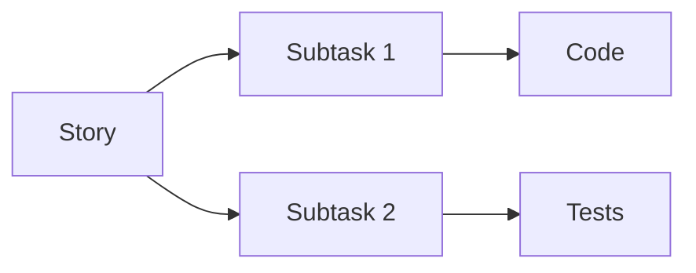

```

**Mermaid Diagrams (optional):**


## 🎓 Lessons from backlog-analyzer

### What Worked Well
✅ **DoR/AC/DoD pattern** - Jasná definice story  
✅ **Subtask breakdown** - Řídí implementaci  
✅ **References section** - Context preservation  
✅ **Metrics section** - Měřitelné cíle

### What to Improve
🔧 **Simpler path mapping** - backlog-analyzer má O2-specific fields  
🔧 **No JIRA ties** - Pure Git-native  
🔧 **Lighter structure** - Méně required sections

### Innovations for core-platform
🚀 **Git-first tracking** - Commit → Story mapping  
🚀 **Copilot optimization** - Better prompts  
🚀 **Auto-validation** - Schema enforcement

---

**Story Status: 🔴 TODO
**Assignee:** Development Team  
**Reviewer:** Tech Lead  
**Epic:** EPIC-001 Backlog System  
**Created:** 2025-11-06  
**Started:** 2025-11-06  
**Target:** 2025-11-07 (1 day)
