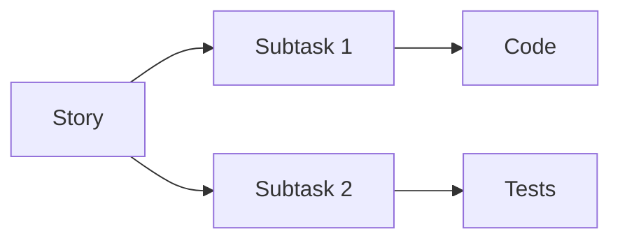

# CORE-001: Markdown Structure & Templates

## 👤 Role / Potřeba / Benefit

**Jako** developer v core-platform týmu  
**Chci** konzistentní Markdown strukturu pro backlog  
**Abych** mohl snadno psát User Stories, které GitHub Copilot pochopí a použije pro generování kódu

## ✅ Definition of Ready (DoR)

- [x] Epic EPIC-001 approved
- [x] Analyzed backlog-analyzer structure (`examples/sample-story/`)
- [x] Reviewed GitHub Markdown best practices
- [x] Team alignment on directory structure
- [x] VS Code + GitHub Copilot available

## 🎯 Akceptační kritéria (AC)

### AC1: Základní adresářová struktura existuje
**Given** prázdný core-platform repo  
**When** vytvořím backlog strukturu  
**Then** musí existovat:

```
backlog/
├── templates/
│   ├── story.md
│   ├── subtask.md
│   └── epic.md
├── EPIC-001-backlog-system/
│   ├── README.md
│   └── stories/
│       └── CORE-001-markdown-structure/
│           └── README.md
└── index.md
```

**Validace:**
```bash
test -d backlog/templates && \
test -f backlog/templates/story.md && \
test -f backlog/EPIC-001-backlog-system/README.md
```

### AC2: Story template obsahuje všechny required sekce
**Given** story template `backlog/templates/story.md`  
**When** otevřu template  
**Then** musí obsahovat tyto sekce:

- [ ] `## 👤 Role / Potřeba / Benefit` - User story format
- [ ] `## ✅ Definition of Ready (DoR)` - Checklist
- [ ] `## 🎯 Akceptační kritéria (AC)` - Testovatelná kritéria
- [ ] `## 📂 Implementation Mapping` - Code/Test/Docs paths
- [ ] `## ✅ Definition of Done (DoD)` - Completion criteria
- [ ] `## 📋 Subtasks` - Breakdown na implementační tasky
- [ ] `## 🔗 Related Stories` - Dependencies
- [ ] `## 📊 Metrics` - Success criteria

**Validace:**
```bash
grep -q "## 👤 Role / Potřeba / Benefit" backlog/templates/story.md && \
grep -q "## 📂 Implementation Mapping" backlog/templates/story.md
```

### AC3: Subtask template má implementační strukturu
**Given** subtask template `backlog/templates/subtask.md`  
**When** vytvořím subtask ze template  
**Then** musí obsahovat:

- [ ] `## 🎯 Subtask Goal` - Konkrétní cíl
- [ ] `## ✅ Acceptance Criteria` - Co musí být splněno
- [ ] `## 📂 Files to Modify/Create` - Konkrétní soubory
- [ ] `## 🔧 Implementation Steps` - Krok za krokem
- [ ] `## ✅ Testing` - Jak otestovat
- [ ] `## 📖 References` - Links na docs/code

### AC4: Epic template strukturuje velké celky
**Given** epic template `backlog/templates/epic.md`  
**When** vytvořím epic  
**Then** musí obsahovat:

- [ ] `## 🎯 Epic Goal` - High-level cíl
- [ ] `## 📊 Epic Scope` - In/Out scope
- [ ] `## 📋 User Stories` - Seznam stories
- [ ] `## 📅 Timeline` - Plánované milestones
- [ ] `## 🎯 Success Criteria` - Epic completion metrics
- [ ] `## 🔗 Dependencies` - Upstream/Downstream
- [ ] `## ✅ Epic Definition of Done` - Epic completion

### AC5: Example story (CORE-001 sám sebe) je kompletní
**Given** tento dokument CORE-001  
**When** použiju jako referenční příklad  
**Then** musí demonstrovat:

- [x] Správné použití template struktury
- [ ] Path mapping (až bude implementace)
- [ ] DoR/AC/DoD checklisty
- [ ] Subtask breakdown
- [ ] Metrics definition

## 📂 Implementation Mapping

### Template Files (CREATE)
```yaml
templates:
  - backlog/templates/story.md           # Story template
  - backlog/templates/subtask.md         # Subtask template  
  - backlog/templates/epic.md            # Epic template
  - backlog/templates/README.md          # Template usage guide
```

### Documentation (CREATE)
```yaml
docs:
  - backlog/README.md                    # Backlog system overview
  - backlog/index.md                     # Backlog dashboard
  - docs/development/backlog-workflow.md # Developer guide
```

### Example Stories (CREATE)
```yaml
examples:
  - backlog/EPIC-001-backlog-system/README.md           # This epic
  - backlog/EPIC-001-backlog-system/stories/CORE-001/   # This story (self-documenting)
```

### Validation Scripts (DEFER to CORE-005)
```yaml
validation:
  - scripts/backlog/validate.py          # Story validator (CORE-005)
  - scripts/backlog/schema.yaml          # Schema definition (CORE-005)
```

## ✅ Definition of Done (DoD)

### Code Complete
- [ ] All 4 templates created (`story.md`, `subtask.md`, `epic.md`, `README.md`)
- [ ] Templates contain all required sections per AC2-AC4
- [ ] Template README explains usage with examples
- [ ] Directory structure matches AC1

### Documentation Complete
- [ ] `backlog/README.md` vysvětluje celý systém
- [ ] Template usage guide v `backlog/templates/README.md`
- [ ] Developer guide v `docs/development/backlog-workflow.md`
- [ ] Example story (CORE-001) kompletní

### Quality Checks
- [ ] Markdown valid (no syntax errors)
- [ ] All links working (no 404s)
- [ ] Templates tested (create 1 test story from each)
- [ ] VS Code Markdown preview renders correctly

### Team Alignment
- [ ] Templates reviewed by team (workshop)
- [ ] Team understands how to use templates
- [ ] GitHub Copilot tested with templates (generates code)
- [ ] Feedback incorporated

### Git & Integration
- [ ] All files committed to Git
- [ ] Branch `feature/CORE-001-markdown-structure` merged to `main`
- [ ] README.md updated (link to backlog)
- [ ] No breaking changes to existing structure

## 📋 Subtasks

### Subtask 1: Create Directory Structure (30 min)
**File:** [subtasks/01-directory-structure.md](subtasks/01-directory-structure.md)

- [ ] Create `backlog/` root directory
- [ ] Create `backlog/templates/` subdirectory
- [ ] Create `backlog/EPIC-001-backlog-system/` epic folder
- [ ] Create `backlog/EPIC-001-backlog-system/stories/CORE-001/` story folder
- [ ] Test directory structure matches AC1

**Files:**
- Directories only (no files yet)

### Subtask 2: Story Template (2 hours)
**File:** [subtasks/02-story-template.md](subtasks/02-story-template.md)

- [ ] Create `backlog/templates/story.md`
- [ ] Add all 8 required sections (AC2)
- [ ] Add inline examples and comments
- [ ] Add YAML frontmatter for metadata
- [ ] Test template with dummy story

**Files:**
- `backlog/templates/story.md`

### Subtask 3: Subtask Template (1 hour)
**File:** [subtasks/03-subtask-template.md](subtasks/03-subtask-template.md)

- [ ] Create `backlog/templates/subtask.md`
- [ ] Add all 6 required sections (AC3)
- [ ] Link to parent story pattern
- [ ] Test with CORE-001 subtasks

**Files:**
- `backlog/templates/subtask.md`

### Subtask 4: Epic Template (1 hour)
**File:** [subtasks/04-epic-template.md](subtasks/04-epic-template.md)

- [ ] Create `backlog/templates/epic.md`
- [ ] Add all 7 required sections (AC4)
- [ ] Add progress tracking section
- [ ] Test with EPIC-001

**Files:**
- `backlog/templates/epic.md`

### Subtask 5: Documentation & Examples (2 hours)
**File:** [subtasks/05-documentation.md](subtasks/05-documentation.md)

- [ ] Create `backlog/README.md` (system overview)
- [ ] Create `backlog/templates/README.md` (usage guide)
- [ ] Create `backlog/index.md` (dashboard)
- [ ] Create `docs/development/backlog-workflow.md`
- [ ] Add examples to template README

**Files:**
- `backlog/README.md`
- `backlog/templates/README.md`
- `backlog/index.md`
- `docs/development/backlog-workflow.md`

### Subtask 6: Testing & Validation (1 hour)
**File:** [subtasks/06-testing.md](subtasks/06-testing.md)

- [ ] Create test story from story template
- [ ] Create test subtask from subtask template
- [ ] Verify Markdown renders in GitHub
- [ ] Test with GitHub Copilot (generate code from story)
- [ ] Collect feedback from team

**Files:**
- None (testing only)

**Total Estimated Time:** 7.5 hours

## 🔗 Related Stories

### Dependencies (Blocked By)
- ✅ EPIC-001 approved (done)

### Blocks
- **CORE-002** (Path Mapping) - Needs story template structure
- **CORE-003** (Story Generator) - Needs templates to copy from
- **CORE-005** (Validator) - Needs template schema definition

### Related
- **CORE-004** (Git Tracker) - Will use story IDs from templates
- **CORE-006** (Makefile) - Will use template paths

## 📊 Metrics & Success Criteria

### Before Implementation
- **Template Availability:** 0 templates
- **Story Consistency:** Každý píše jinak
- **Copilot Usability:** Low (nekonzistentní formát)

### After Implementation (Targets)
- **Template Availability:** 3 templates (story/subtask/epic)
- **Template Usage:** 100% new stories use template
- **Story Completeness:** 90%+ stories mají všechny required sekce
- **Copilot Code Generation:** Funguje na 80%+ stories

### Validation Criteria
```bash
# All templates exist
test -f backlog/templates/story.md
test -f backlog/templates/subtask.md
test -f backlog/templates/epic.md

# Templates have required sections
grep -q "## 👤 Role / Potřeba / Benefit" backlog/templates/story.md
grep -q "## 📂 Implementation Mapping" backlog/templates/story.md

# Documentation exists
test -f backlog/README.md
test -f backlog/templates/README.md
test -f docs/development/backlog-workflow.md

# Example story complete
test -f backlog/EPIC-001-backlog-system/stories/CORE-001/README.md
```

## 📝 Implementation Notes

### Template Design Decisions

**1. Markdown over YAML/JSON**
- **Rationale:** GitHub renders beautifully, Copilot understands better
- **Tradeoff:** Less structured than YAML, but more readable

**2. Emoji Section Headers**
- **Rationale:** Visual scanning, matches GitHub culture
- **Tradeoff:** Some might find unprofessional, but improves UX

**3. Path Mapping in Story (not separate file)**
- **Rationale:** Single source of truth, easier to update
- **Tradeoff:** Story files are longer

**4. Checkboxes for DoR/AC/DoD**
- **Rationale:** GitHub renders interactively, clear progress
- **Tradeoff:** Manual checkbox management

### Inspiration from backlog-analyzer

**Kept from backlog-analyzer:**
```markdown
## 👤 Role / Potřeba / Benefit
**Jako** [role]
**Chci** [feature]
**Abych** [benefit]
```

**Enhanced for core-platform:**
```markdown
## 📂 Implementation Mapping
code_paths:
  - backend/src/.../
test_paths:
  - backend/src/test/.../
```

### GitHub Copilot Optimization

**Prompt-friendly structure:**
- Clear section headers → Copilot knows where to look
- AC with Given/When/Then → Copilot generates tests
- Path mapping → Copilot knows where to write code
- Technical notes → Copilot understands constraints

**Example Copilot prompt:**
```
"Implementuj story backlog/EPIC-001-backlog-system/stories/CORE-002/README.md.
Vytvoř všechny soubory podle Implementation Mapping sekce.
Dodržuj AC a technical notes."
```

### Future Enhancements (Deferred)

**YAML Frontmatter (optional):**
```yaml
---
id: CORE-001
epic: EPIC-001
priority: P1
status: in-progress
assignee: dev-team
created: 2025-11-06
---
```

**Mermaid Diagrams (optional):**


## 🎓 Lessons from backlog-analyzer

### What Worked Well
✅ **DoR/AC/DoD pattern** - Jasná definice story  
✅ **Subtask breakdown** - Řídí implementaci  
✅ **References section** - Context preservation  
✅ **Metrics section** - Měřitelné cíle

### What to Improve
🔧 **Simpler path mapping** - backlog-analyzer má O2-specific fields  
🔧 **No JIRA ties** - Pure Git-native  
🔧 **Lighter structure** - Méně required sections

### Innovations for core-platform
🚀 **Git-first tracking** - Commit → Story mapping  
🚀 **Copilot optimization** - Better prompts  
🚀 **Auto-validation** - Schema enforcement

---

**Story Status:** 🔄 **IN PROGRESS** (creating templates)  
**Assignee:** Development Team  
**Reviewer:** Tech Lead  
**Epic:** EPIC-001 Backlog System  
**Created:** 2025-11-06  
**Started:** 2025-11-06  
**Target:** 2025-11-07 (1 day)
